# Project Background 
Since the discovery of the Higgs boson in 2012, a particle central to our understanding of physics, teams at the Large Hadron Collider (LHC) - specifically the ATLAS and CMS collaborations - have been delving into its properties. Their research aims to verify how well this particle aligns with the Standard Model of particle physics, the current best theory describing fundamental particles and forces. Particularly, they are examining the Higgs boson's mass, which is measured to be around 125 GeV, and confirming that its observed characteristics are in line with theoretical predictions.

A key focus of this research is exploring how Higgs bosons interact with themselves and with other particles, such as W and Z bosons. These interactions are described by specific parameters like trilinear and quartic self-couplings. Scientists measure the frequency of processes where pairs of Higgs bosons are produced - primarily through gluon fusion (ggF) and vector-boson fusion (VBF) - to understand these interactions. Accurate measurements of these occurrences help researchers verify if the Higgs boson behaves as our theories predict or if there are signs of new physics beyond our current understanding.

  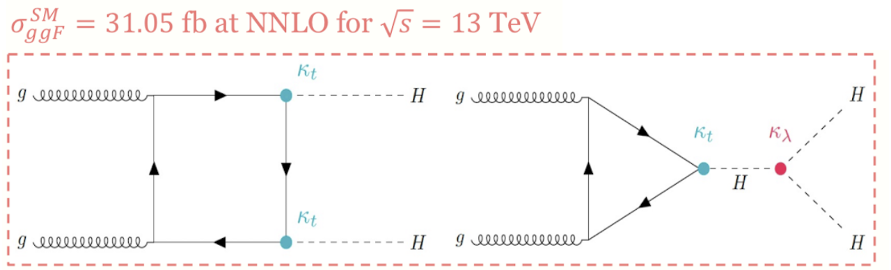
  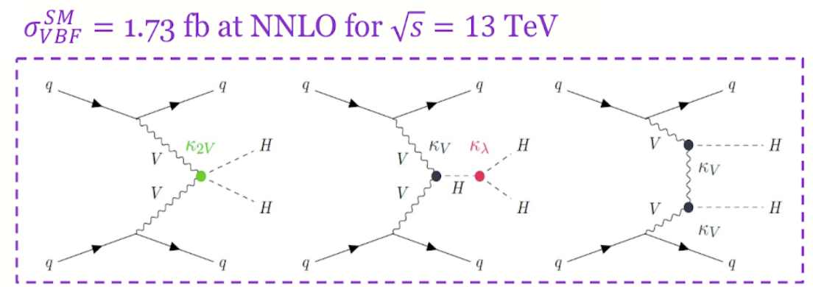 
  
<em>Caption: Feynman diagram on the most dominant production modes for di-higgs production.</em>

A new iteration of the HH → bbττ search in Run 2, the legacy analysis in ATLAS jargon, has begun in early 2023. This analysis incorporates four major improvements: 1) dedicated VBF and ggF regions, where ggF is further divided into a high-mHH and low-mHH region to increase sensitivity, a 2) fully harmonized multivariate technique strategy that optimizes BDTs in both lephad and hadhad channels as a fit discriminant for ggF/VBF classification, 3) optimized binning and new background modeling, and an 4) EFT interpretation of the results will also be produced

# Role in Project
In this analysis, I have taken on the key role of paper editor, overseeing the entire research process, with a particular emphasis on optimizing event selection, a crucial aspect of the analysis. As one of the core members of the team, my responsibilities include leading the harmonization of the multivariate strategy for the bbtautau final state channel. My involvement is extensive in both the vector-boson fusion (VBF) and gluon fusion (ggF) processes, focusing on areas with high-mass Higgs boson pairs (high-mHH) and regions with lower Higgs boson pair production (low-HH).

My contributions are central to several significant improvements in the analysis. These include the introduction of dedicated regions for analyzing ggF and VBF processes, and the development of a fully harmonized multivariate technique. This technique optimizes Boosted Decision Trees (BDTs) in both the lepton-hadron and hadron-hadron channels, serving as a discriminant for classifying ggF and VBF events. Specifically, I am leading the effort to harmonize the multivariate strategy for the lepton-hadron channel and am deeply involved in all the optimizations mentioned.

**Unfortunately, due to privacy and security measures implemented at CERN, specific details and code from these experiments are not be publicly viewable.** 
# Results 

Showing the plots I produced

### ML Optimization

**1. ggF high-mHH region**

  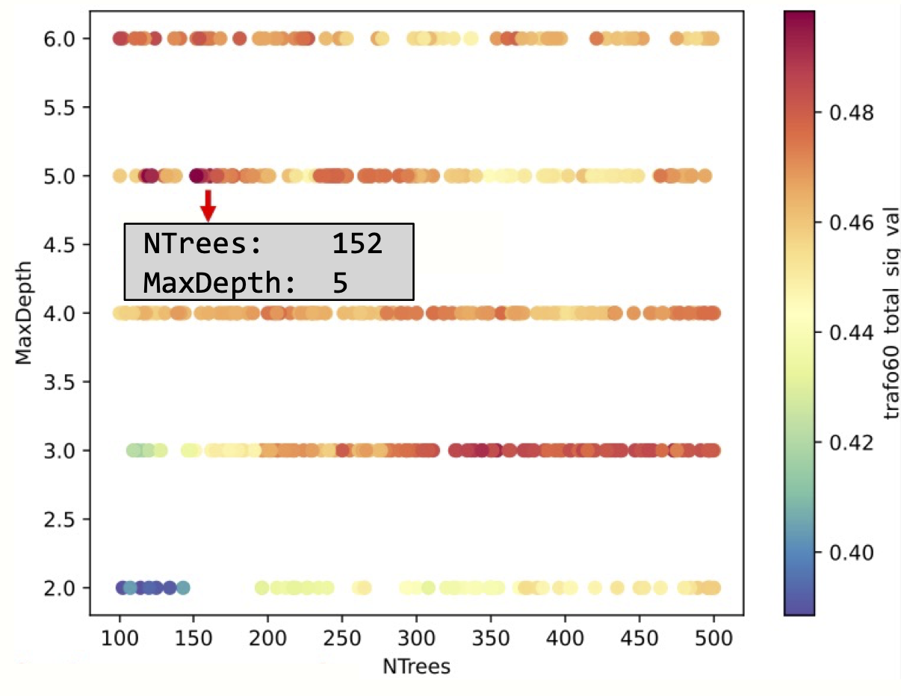
  
<em>Caption: Hyperparameter Optimization of ggF high-mHH (> 350 GeV) region.</em>

  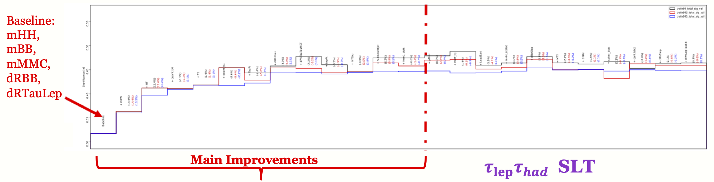
  
<em>Caption: Input Variable Optimization of ggF high-mHH (> 350 GeV) region.</em>

**2. ggF low-mHH region**

  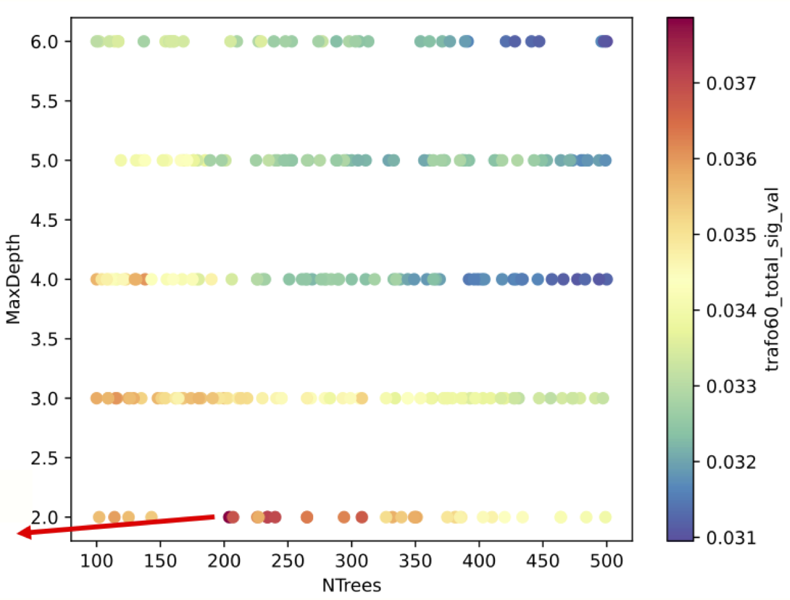
  
<em>Caption: Hyperparameter Optimization of ggF low-mHH (< 350 GeV) region.</em>

  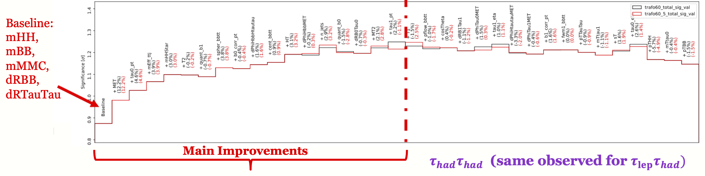
  
<em>Caption: Input Variable Optimization of ggF low-mHH (< 350 GeV) region.</em>

**3. VBF region**

  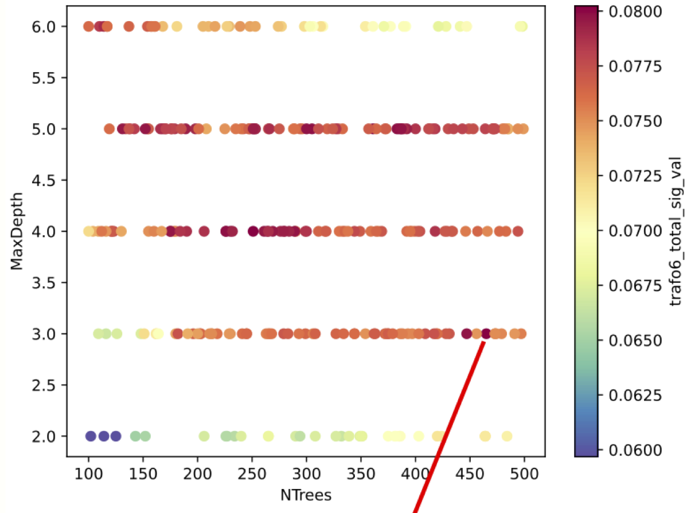
  
<em>Caption: Hyperparameter Optimization of VBF region.</em>

  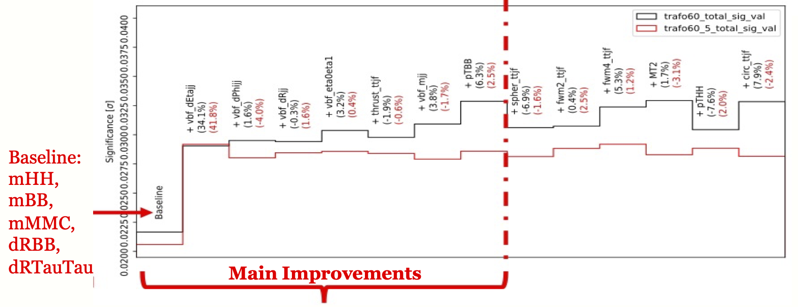
  
<em>Caption: Input Variable Optimization of VBF region.</em>

**4. ggF/VBF region** 

  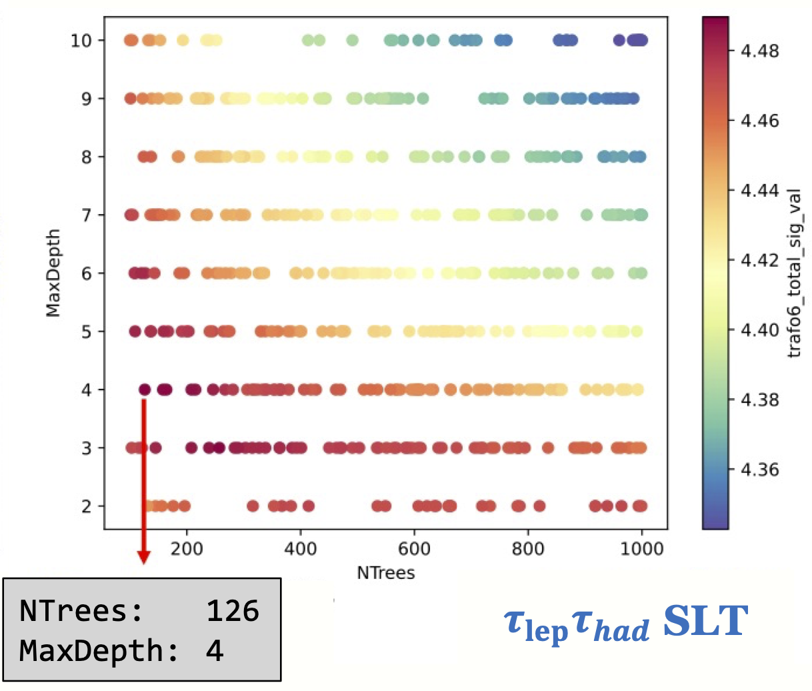
  
<em>Caption: Hyperparameter Optimization of ggF-VBF region.</em>

  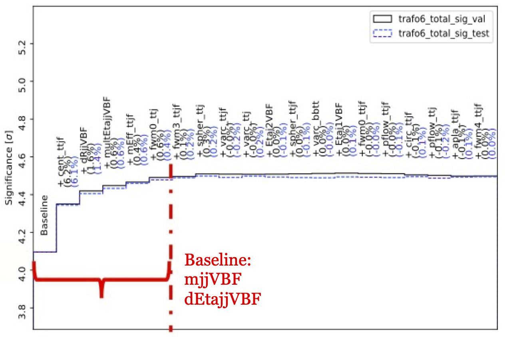
  
<em>Caption: Input Variable Optimization of ggF-VBF region.</em>

The plots show the hyperparameters (focusing on NTrees and MaxDepth) for Boosted Decision Trees and input variables for each region optimized using the Bayesian Algorithm. I was able to significantly reduce the variable numbers for each region only keeping the ones that gives the best signal-background (noise) separation. 

### Negative Log Likelihood Scans and Upper Limits 

  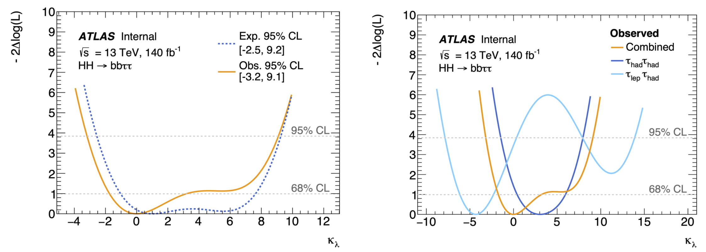
  
<em>Caption: kappaL NLL Scan, left: Combined, right: by channel. Kappa2V is fixed and kappaL is varied</em>

  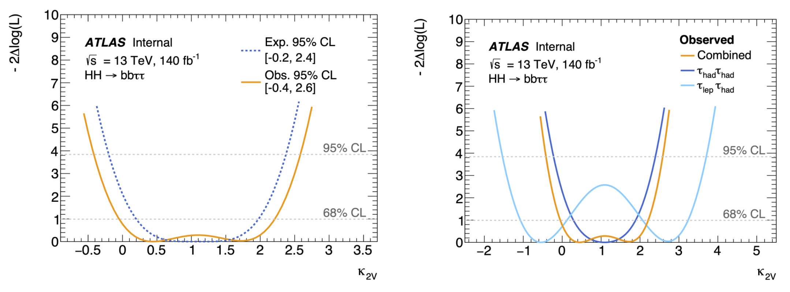
  
<em>Caption: kappa2V NLL Scan. left: Combined, right: by channel. KappaL is fixed and kappa2V is varied</em>

Calculating the Negative Log-Likelihood (NLL) scans has been crucial for analyzing and interpreting complex experimental data. This statistical method provides a quantifiable measure of how well theoretical models align with observed data, by assessing the probability of data occurrence under various model parameters. By minimizing the NLL, I can accurately determine the model parameters that best fit the data, thus offering a robust way to estimate particle properties and their interactions. Furthermore, NLL scans enable me to construct confidence intervals for these parameters, crucial for understanding their precision and reliability. This approach is integral to my work, enhancing the reliability and depth of my findings in the realm of high-energy physics. The plots above had one kappa fixed, as for the plot below, both kappa values are varied. 

  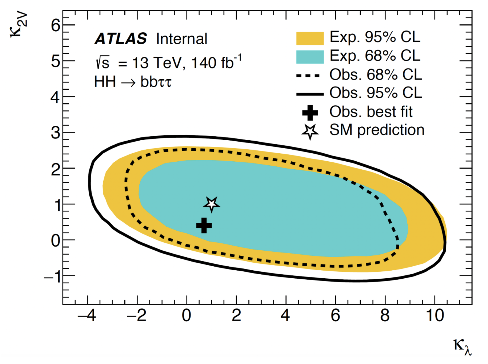
  
<em>Caption: kappaL NLL Scan, left: Combined, right: by channel. Kappa2V is fixed and kappaL is varied</em>

