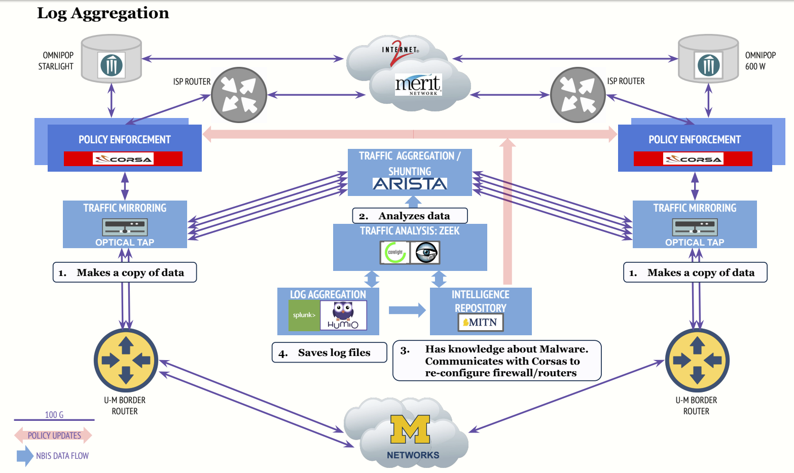
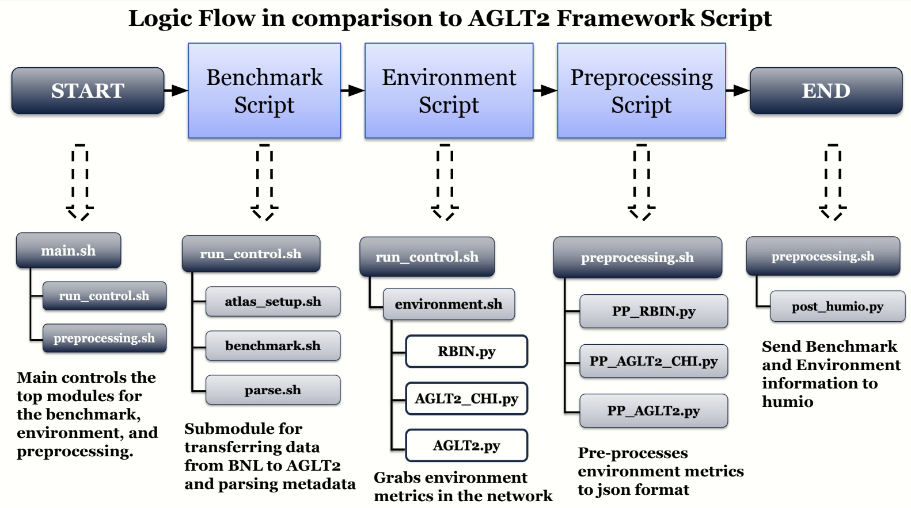

# Project Background 
NETwork Border At Scale Integrating and Leveraging Individual Security Components (NetBASILISK) seeks to expand the Science DMZs by enabling Internet measurement and monitoring without distorting the resulting data. NetBASILISK observes traffic by 1) making a  a copy of data through e.g Optical Taps/Mirrored Ports, 2) analyzing the data to search patterns to determine possible malicious threats, and 3) connecting to router/firewall to reconfigure and update the system to recognize malicious threats. 

  
  
<em>Caption: NetBASILISK Prototype Deployment at UofM.</em>

# Role in Project
The Physics department receives large data from outside sources (e.g ATLAS data from CERN). Therefore, my role is to evaluate the impact of NetBASILISK on data coming into the University of Michigan by:

**1. Benchmark Application:**
- Simulate data movement from an external source coming into UofM Network
- Main deliverable: bandwidth (basis for transfer performance)

**2. Environment Monitoring Application:**
- Monitor relevant factors other than NetBASILISK that might impact transfers
- Main deliverable: network metrics from the source, destination, and network-in-between 

  
  
<em>Caption: Logic Flow in comparison to AGLT2 Framework Script.</em>

# Results
