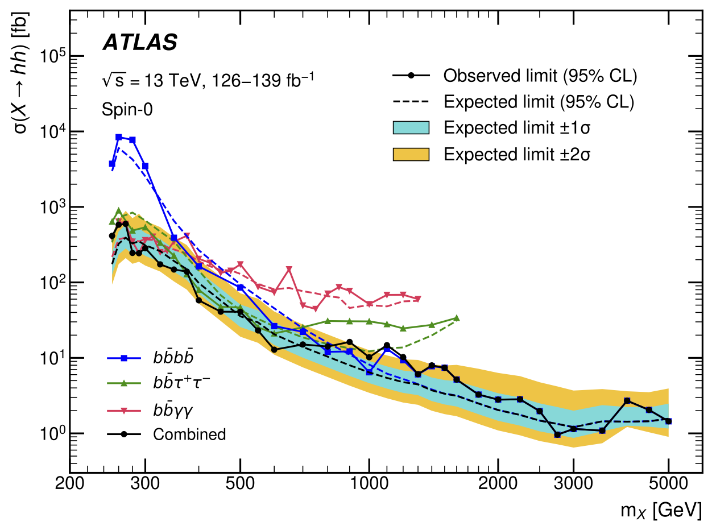

# Project Background 

The Higgs boson is the cornerstone of the Standard Model of particle physics. It is a fundamental particle that explains how other particles acquire mass. Its groundbreaking discovery in 2012 marked a significant milestone in our understanding of the universe's structure. However, there's still much to uncover about the Higgs boson and its properties, and experimentally measuring Higgs boson pairs will help us understand the shape of the Higgs potential and delve into fundamental questions about its properties.

A new study conducted by the ATLAS Collaboration at CERN presents a combination of searches for resonant Higgs boson pair production. The study utilizes up to 139 $fb^{-1}$ of $pp$ collision data at a center-of-mass energy of $\sqrt{s} = 13$  TeV, recorded with the ATLAS detector at the Large Hadron Collider (LHC). The searches included in this combination analysis were performed in three different decay channels: $b\bar{b}b\bar{b}$, $bb\tau^{+}\tau^{-}$, and $bb\gamma\gamma$. The aim was to search for any excess signal above the expected background that could indicate the production of Higgs boson pairs. However, no significant excess above the expected background was observed in any of the decay channels. As a result, upper limits were set at the 95% confidence level on the production cross section of Higgs boson pairs originating from the decay of a narrow scalar resonance. The mass range considered for this resonance, defined as $m_{X}$, was between 251 GeV and 5 TeV. The observed (expected) limits on the production cross section were found to be in the range of 0.96-600 fb (1.2-390 fb). These limits have important implications for theoretical models such as the Type-I Two-Higgs-Doublet Model and the Minimal Supersymmetric Standard Model. In particular, they constrain parameter space that was not previously excluded by other searches. Overall, this study provides valuable insights into resonant Higgs boson pair production and contributes to our understanding of fundamental particles and their interactions. The results obtained from these searches will help guide future research efforts in particle physics and potentially lead to new discoveries in this field.

# Role in Project 
I conducted an analysis of the data, focusing on a wide range of $m_{X}$ values from 251 GeV to 5 TeV, and compared it to the expected outcomes based on the Standard Model (SM) predictions. I produced two plots, 1) illustrates the statistical significance of our findings, represented by the local p-value, as a function of $m_{X}$ for a specific scenario: a narrow resonance decaying into a pair of SM Higgs bosons with predicted branching ratios under $m_{h}$ = 125 GeV. Notably, we observed the most significant deviation at 1.1 TeV, with a local significance of 3.3$\sigma$, which translates to a global significance of 2.1$\sigma$ when considering multiple trials. The second plot I produced 2) presents the upper limits at the 95% confidence level (CL) on the production of resonant $hh$ pairs as a function of $m_{X}$, assuming that $h$ corresponds to the SM Higgs boson.

**Unfortunately, due to privacy and security measures implemented at CERN, specific details and code from these experiments are not be publicly viewable.** 
# Results 

  
  
<em>Caption: Local p-value at the 95% CL on the resonant Higgs boson pair production cross section as a function of the resonance mass.</em>

  
  
<em>Caption: Observed and expected upper limits at the 95% CL on the resonant Higgs boson pair production cross section as a function of the resonance mass.</em>

