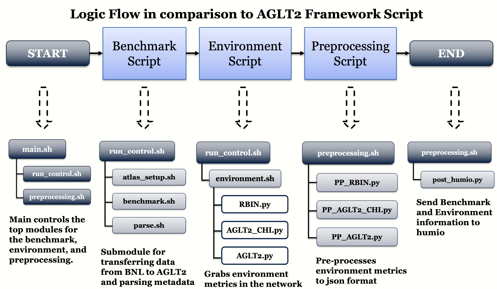

## NetBASILISK Overview 

The NetBASILISK (Network Border at Scale Integrating and Leveraging Individual Security Components) project aims to deploy and produce a network border security 
solution that provides a more efficient security monitoring infrastructure and monitoring software to protect resources without impacting scientific research and 
collaboration. The main motivation behind the project was to produce an alternative solution to previous tools such as the 
firewall and Science DMZs. The NetBASILISK project has three main science drivers:

* **Physics** 
* Cryo-Electron Microscopy (Cryo-EM)
* Electrical Engineering and Computer Science (EECS)

In Physics, the use-case scenario would be receiving large data from external collaborators (e.g CERN and BNL). This repository is dedicated to building a 
benchmark for network testing in to understand the impact of NetBASILISK when importing ATLAS data to the AGLT2 UM Cluster. The benchmark has to be reproducible
in order to evaluate the performace of importing data to AGLT2. 

## AGLT2 Framework Script 
To understand if NetBASILISK impacts the transfer of external data to the university, we need to:

* Determine normal transfer behavior in the absence of NetBASILISK (get a baseline).
* Monitor relevant factors **other** than NetBASILISK that might impact transfers.
* Create a benchmark test which can be run on-demand to determine transfer rates.

Using this set of information and tools, we can evaluate if NetBASILISK (or changes in NetBASILISK) are adversely impacting our ability to transfer data to the University of Michigan. The two capabilities we need to evaluate NetBASILISK’s potential impact are a benchmark application, which can be used both to derive a baseline and make on-demand evaluation of the current transfer performance, and an environmental monitoring application which can gather and track relevant metrics that might be related to the observed transfer performance.

<p align="center">
  
</p>


## Requirements 
**Grid Certificate**<br/> 
The script requires using grid resources. To gain access, you have to obtain a grid certificate. Instructions here: https://www.racf.bnl.gov/docs/howto/grid/getcert 

**Virtual Organization (VO)** <br/>
After obtaining a grid certificate, you need to become a member of a virtual organization (VO) and add your grid certificate to the membership list
on a VOMS (Virtual Organization Management System) server. Instructions here: https://www.racf.bnl.gov/docs/howto/grid/joinvo

**Using the Grid**  <br/>
Install the grid certificate in your home directory and web browser. Instructions here: https://www.racf.bnl.gov/docs/howto/grid/installcert

## How to Use 
Clone the package and create a directory for output files 
``` 
git clone git@github.com:NetBASILISK/AGLT2.git
cd AGLT2
mkdir Output
```
Go to the Script directory and setup the virtual environment and rucio <br/> <br/>
**Virtual environment**:
```
cd Scripts
source env/bin/activate 
```
**Rucio environment** <br/>
Setup for the environment depends on the site or experiment. For ATLAS,
```
export ATLAS_LOCAL_ROOT_BASE="/cvmfs/atlas.cern.ch/repo/ATLASLocalRootBase"
alias setupATLAS="source ${ATLAS_LOCAL_ROOT_BASE}/user/atlasLocalSetup.sh"
setupATLAS
lsetup rucio 
```
**VOMS Proxy** <br/>
```
voms-proxy-init -voms atlas <<!
<passwd>
!
```
Run the script in background using the following command: 
```
nohup bash main.sh &>/dev/null &
```

## Contact
For any question,please use the following contact to get in touch with developlers: <br/>
**Jem Guhit**: Graduate Student, Physics. University of Michigan, Ann Arbor, MI, USA. guhitj@umich.edu <br/>
**Shawn McKee**: Research Scientist. University of Michigan, Ann Arbor, MI, USA. smckee@umich.edu <br/>
**Kris Steinhoff**: School of Information, University of Michigan, Ann Arbor, MI, USA. steinhof@umich.edu <br/>
**Edward Colone**: Information and Technology Services, University of Michigan, Ann Arbor, MI, USA. epcjr@umich.edu <br/>
