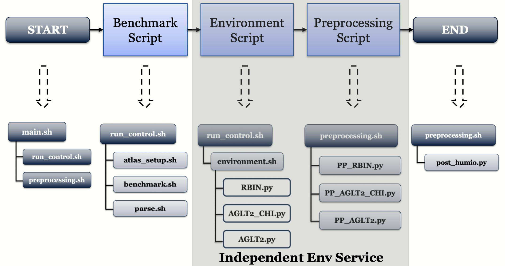

##  Environment Monitoring Scripts for NetBASILISK 
This repository contains the most updated environment scripts for the NetBASILISK project. This framework is an independent environment service which grabs metrics from the environment paths. <br/> <br/>
Refer to https://github.com/NetBASILISK/AGLT2 for the framework containing both Benchmark and Environment. 

<p align="center">
  
</p>

## How to Use 
Clone the package and create a directory for output files 
``` 
git clone git@github.com:NetBASILISK/EnvironmentMonitoring.git
cd EnvironmentMonitoring
mkdir Output
```
Setup the virtual environment
```
source env/bin/activate 
```
Go to the Scripts directory and run the script in background using the following command: 
```
cd Scripts
nohup bash IndEnv.sh &>/dev/null &
```
## Contact
For any question,please use the following contact to get in touch with developlers: <br/>
**Jem Guhit**: Graduate Student, Physics. University of Michigan, Ann Arbor, MI, USA. guhitj@umich.edu <br/>
**Shawn McKee**: Research Scientist. University of Michigan, Ann Arbor, MI, USA. smckee@umich.edu <br/>
